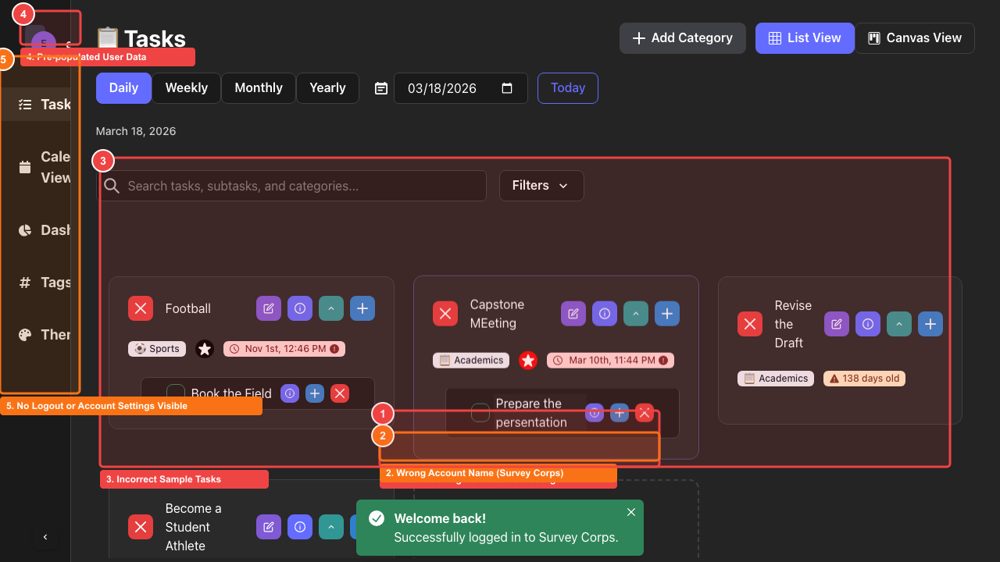

# UX Findings Report: DreamDuo

**Generated:** 2026-03-19T01:43:05.874Z
**Total Findings:** 5

## Summary

| Severity | Count |
|----------|-------|
| 🔴 Critical | 3 |
| 🟠 High | 2 |
| 🟡 Medium | 0 |
| 🔵 Low | 0 |

---

## Findings by Screen

### After Login

#### 1. Automatic Login / Welcome Message

**Severity:** 🔴 CRITICAL

> Users see "Welcome back! Successfully logged in to Survey Corps" without creating an account - confusing and raises security concerns.

*Element:* Green success toast message

*Location:* x=38%, y=73%, w=28%, h=10%

#### 2. Wrong Account Name (Survey Corps)

**Severity:** 🟠 HIGH

> App is DreamDuo but shows "Survey Corps" - wrong branding or leftover test data.

*Element:* Survey Corps text in toast

*Location:* x=38%, y=77%, w=28%, h=5%

#### 3. Incorrect Sample Tasks

**Severity:** 🔴 CRITICAL

> Random unrelated tasks (Football, Capstone Meeting, Book the Field) appear as if belonging to another user.

*Element:* Task cards showing irrelevant content

*Location:* x=10%, y=28%, w=85%, h=55%

#### 4. Pre-populated User Data

**Severity:** 🔴 CRITICAL

> User avatar (E) and existing tasks suggest logging into someone else's account - privacy concern.

*Element:* User avatar showing E

*Location:* x=2%, y=2%, w=6%, h=6%

#### 5. No Logout or Account Settings Visible

**Severity:** 🟠 HIGH

> No clear way to logout or access account settings from the main view.

*Element:* Left navigation sidebar missing account options

*Location:* x=0%, y=10%, w=8%, h=60%

---

## Raw Data

See `annotations_export.json` for machine-readable data.
